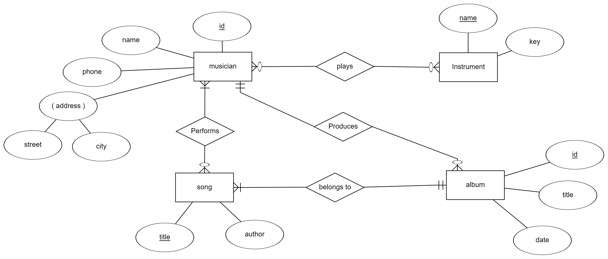
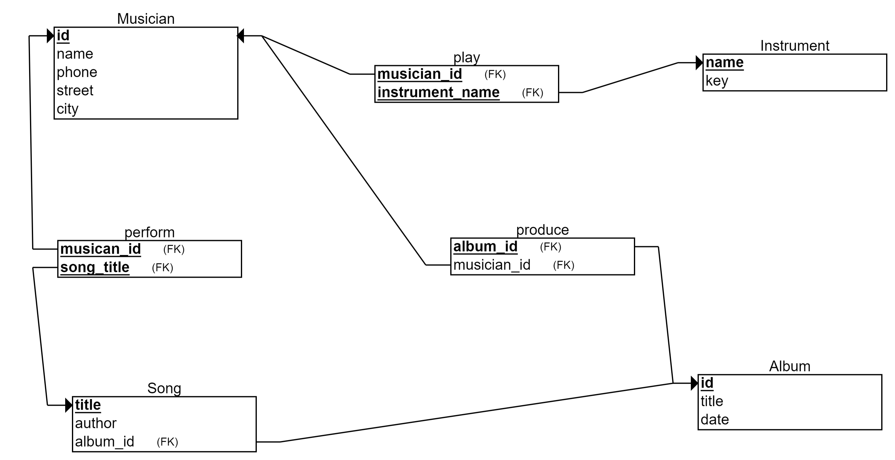
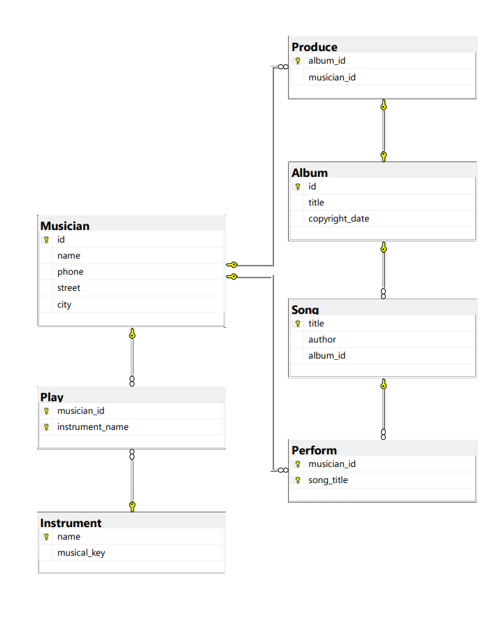

# Project: Musician Company Database

<!-- TOC -->

- [Project: Musician Company Database](#project-musician-company-database)
    - [Business Requirement](#business-requirement)
    - [Entity-Relationship Diagram ERD](#entity-relationship-diagram-erd)
    - [Database Schema](#database-schema)
    - [SQL Server Database Diagram](#sql-server-database-diagram)
    - [Queries](#queries)
        - [Creating the Database](#creating-the-database)
        - [Loading Data](#loading-data)
        - [Practice Joins](#practice-joins)
    - [How to Use](#how-to-use)

<!-- /TOC -->

## Business Requirement

Musicana records have decided to store information on musicians who perform on their albums in a
database. The company has wisely chosen to hire you as a database designer.

- Each musician that is recorded at Musicana has an ID number, a name, an address (street,
  city) and a phone number.
- Each instrument that is used in songs recorded at Musicana has a unique name and a musical
  key (e.g., C, B-flat, E-flat).
- Each album that is recorded at the Musicana label has a unique title, a copyright date, and an
  album identifier.
- Each song recorded at Musicana has a unique title and an author.
- Each musician may play several instruments, and a given instrument may be played by
  several musicians.
- Each album has a number of songs on it, but no song may appear on more than one album.
- Each song is performed by one or more musicians, and a musician may perform a number of
  songs.
- Each album has exactly one musician who acts as its producer. A producer may produce
  several albums.

**_[&uarr; top](#project-musician-company-database)_**

## Entity-Relationship Diagram (ERD)

**_[&uarr; top](#project-musician-company-database)_**

## Database Schema

**_[&uarr; top](#project-musician-company-database)_**

## SQL Server Database Diagram

**_[&uarr; top](#project-musician-company-database)_**

## Queries

### Creating the Database

Run the SQL queries in [create_db.sql](./queries/create_db.sql) to set up the database structure.

### Loading Data

Use [load_data.sql](./queries/load_data.sql) to populate the database with initial data.

### Practice Joins

Experiment with [join_queries.sql](./queries/join_queries.sql) to practice various join operations.

**_[&uarr; top](#project-musician-company-database)_**

## How to Use

1. Open SQL Server Management Studio.

2. Connect to your SQL Server instance.

3. Open and execute the SQL scripts in the `queries` directory using SSMS.

**_[&uarr; top](#project-musician-company-database)_**