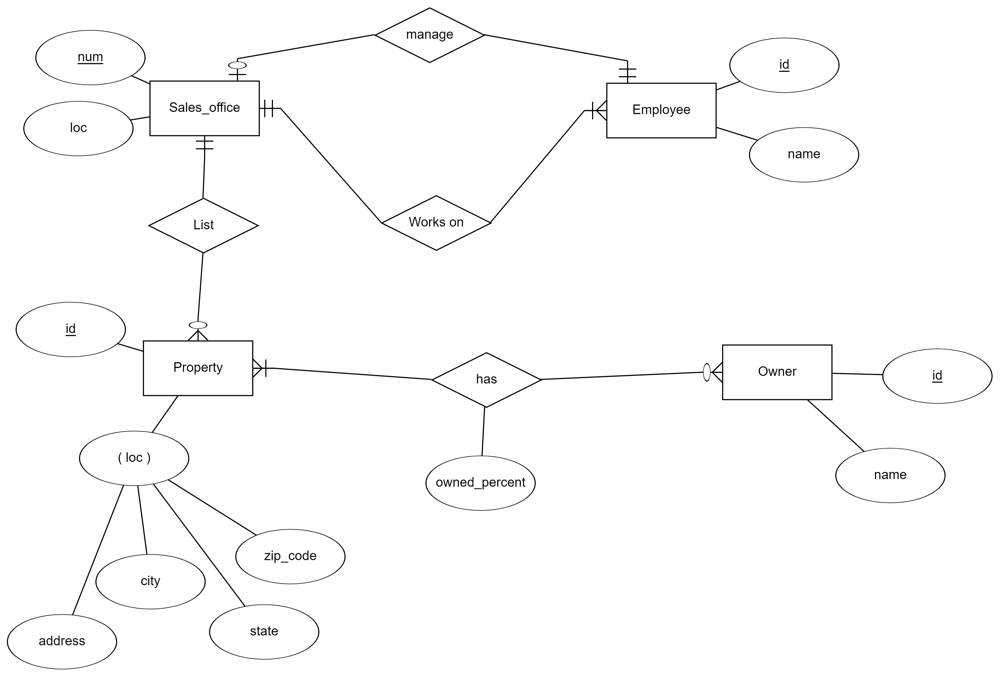
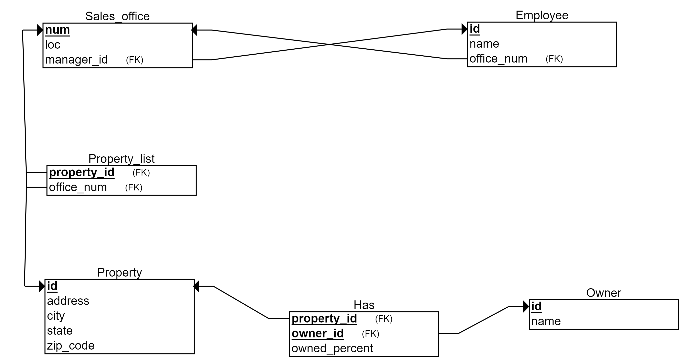
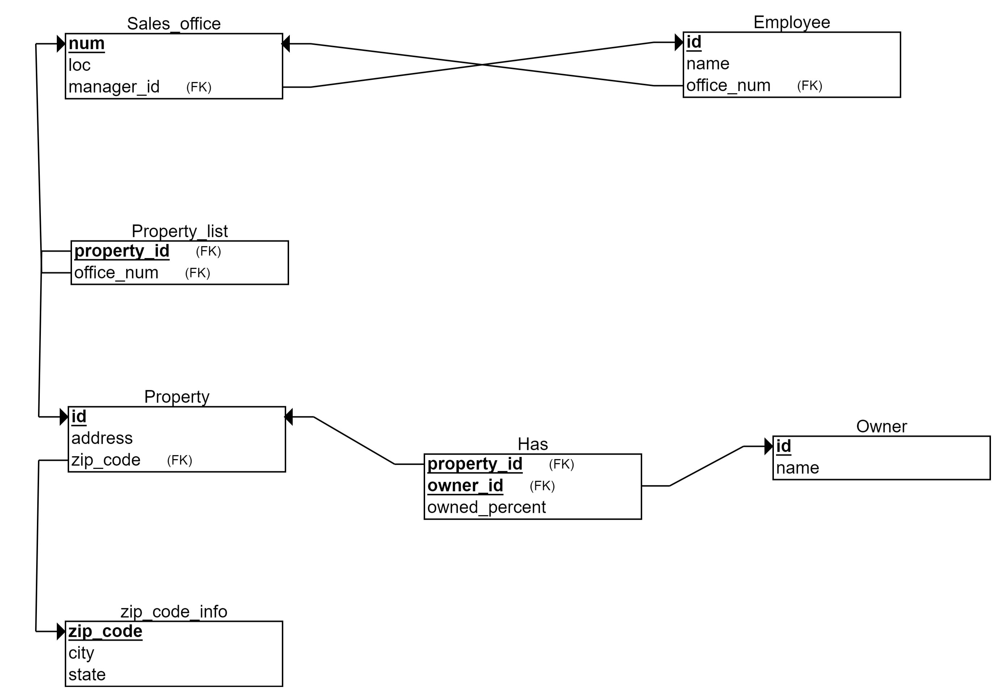
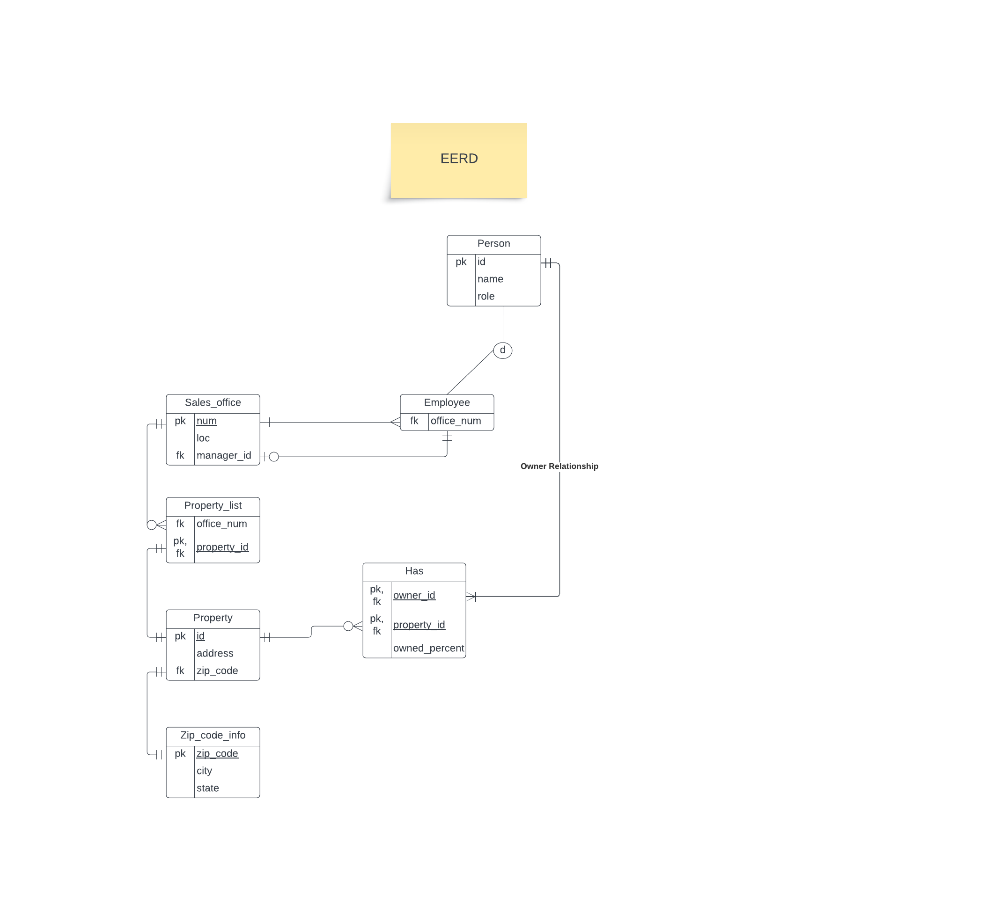

# Project: Sales Office

## Table of Centent

<!-- TOC -->

- [Project: Sales Office](#project-sales-office)
    - [Table of Centent](#table-of-centent)
    - [Business Requirement](#business-requirement)
    - [Entity-Relationship Diagram ERD](#entity-relationship-diagram-erd)
    - [Database Schema](#database-schema)
    - [Normalization](#normalization)
    - [EERD Enhanced ER Diagram](#eerd-enhanced-er-diagram)

<!-- /TOC -->

## Business Requirement

he following describes
this organization:

- The firm has a number of sales offices in several states. Attributes of sales office include
  Office_Number and Location.
- Each sales office is assigned one or more employees. Attributes of employee include
  Employee_ID and Employee_Name. An employee must be assigned to only one sales office.
- For each sales office, there is always one employee assigned to manage that office.
- The firm lists property for sale. Attributes of property include Property_ID and Location.
  Components of Location include Address, City, State, and Zip_Code.
- Each property must be listed with one (and only one) of the sales offices. A sales office may have
  any number of properties listed, or may have no properties listed.
- Each property may have zero or more owners. Attributes of owners are Owner_ID and
  Owner_Name. An owner may own one or more properties. The system stores the percent owned
  by each owner in each property

**_[&uarr; top](#table-of-centent)_**

## Entity-Relationship Diagram (ERD)

**_[&uarr; top](#table-of-centent)_**

## Database Schema

**_[&uarr; top](#table-of-centent)_**

## Normalization

After applying first, second and thrid form of normalization we get this new schema:

**_[&uarr; top](#table-of-centent)_**

## EERD (Enhanced ER Diagram)

**_[&uarr; top](#table-of-centent)_**
